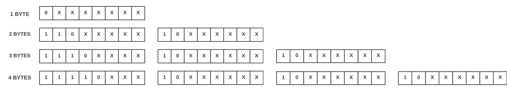

# Custom UTF-8 Strlen 

This project introduces a specialized implementation of the `strlen` function in Assembly, designed to handle both C-strings and UTF-8 encoded strings. Unlike the standard C library's `strlen`, this custom implementation goes a step further by accounting for continuation bytes in UTF-8 encoding.

This gives `my_strlen` the ability to accurately calculate the length of UTF-8 encoded strings in terms of characters. The traditional `strlen` may miscount UTF-8 characters since it focuses on counting the total number of bytes without condsidering continuation bytes, leading to inaccuracies in character length determination. This custom `strlen` ensures precise counting by skipping over continuation bytes, offering a two-in-one solution for developers working with UTF-8 encoded data and regular strings. 

*Note: If you require the size of a string containing UTF-8 non ASCII characters in bytes, then `strlen` should be used.

## Features

- **ASCII String Length:** `my_strlen` can be used in the same way as `strlen`, returning the length of a provided string if all the characters used are ASCII. 

- **UTF-8 Encoded Length:** Unlike regular `strlen`, this implementation of `my_strlen` treats UTF-8 characters which have been encoded into null-terminating strings as if they were ASCII, providing an extra layer of usability comapared to its standard library counterpart.

## How does it work?

The regular 128 ASCII characters most people are familiar with are all represented via a single byte. This makes it simple for `strlen` to determine the character count of a string, as it just needs to count the number of bytes. UTF-8 vastly expands upon the ASCII table of characters by allowing characters to use up to 4 bytes, allowing us to encode our strings with over 1.1 million possible characters and symbols. 



In UTF-8, the prefix of the first byte tells us how many bytes that character uses, for example, if a character uses 3 bytes, the prefix of the first byte will be 1110xxxx. The remaining bytes of the character are called continuation bytes, and provide the information for the character, and each begins with 10xxxxxx. Standard `str_len` will simply count all of these bytes, so a single UTF-8 character that uses 4 bytes would be interpreted as 4 individual characters. To fix this, `my_strlen` scans and accounts for the continuation bytes to ensure proper length calculation.

## Installation and Use

Follow these steps to set up and run the Multithreaded Network Chat in C:

1. Clone the repository to your local machine:

   ```bash
   git clone https://github.com/Daksh2060/multithreaded-chat-networking-c.git
   ```

2. To run the included test file, execute the following command to compile and link (recommended in WSL):

   ```bash
   gcc -Wall -Wpedantic -std=c17 -march=haswell -o test test.c my_strlen.S
   ./test
   ```

3. To use in your own program, include the `my_strlen.h` header in your C file:

   ```bash
   #include "my_strlen.h"
   ```

4. Compile and run your program with the assembly file:

   ```bash
   gcc -Wall -Wpedantic -std=c17 -march=haswell -o [your_program_name] [your_c_file] my_strlen.S
   ./[your_program_name]
   ```

## Contact

Feel free to reach out if you have any questions, suggestions, or feedback:

- **Email:** dpa45@sfu.ca
- **LinkedIn:** [@Daksh Patel](https://www.linkedin.com/in/daksh-patel-956622290/)